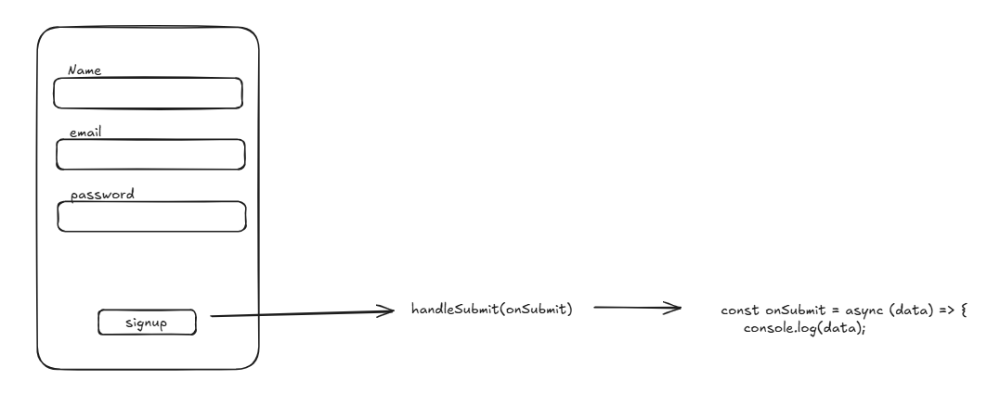

## how it works

## common practice most developer used:

### Schema Validation
We also support schema-based form validation with Yup, Zod , Superstruct & Joi, where you can pass your schema to useForm as an optional config. It will validate your input data against the schema and return with either errors or a valid result.

### Step 1: Install Yup into your project.

    npm install @hookform/resolvers yup

### Step 2: Prepare your schema for validation and register inputs with React Hook Form.

    import { useForm } from "react-hook-form"
    import { yupResolver } from "@hookform/resolvers/yup"
    import * as yup from "yup"

    const schema = yup
    .object({
        firstName: yup.string().required(),
        age: yup.number().positive().integer().required(),
    })
    .required()

    export default function App() {
    const {
        register,
        handleSubmit,
        formState: { errors },
    } = useForm({
        resolver: yupResolver(schema),
    })
    const onSubmit = (data) => console.log(data)

    return (
        <form onSubmit={handleSubmit(onSubmit)}>
        <input {...register("firstName")} />
        
{errors.firstName?.message}

        <input {...register("age")} />
        
{errors.age?.message}

        <input type="submit" />
        </form>
    )
    }

